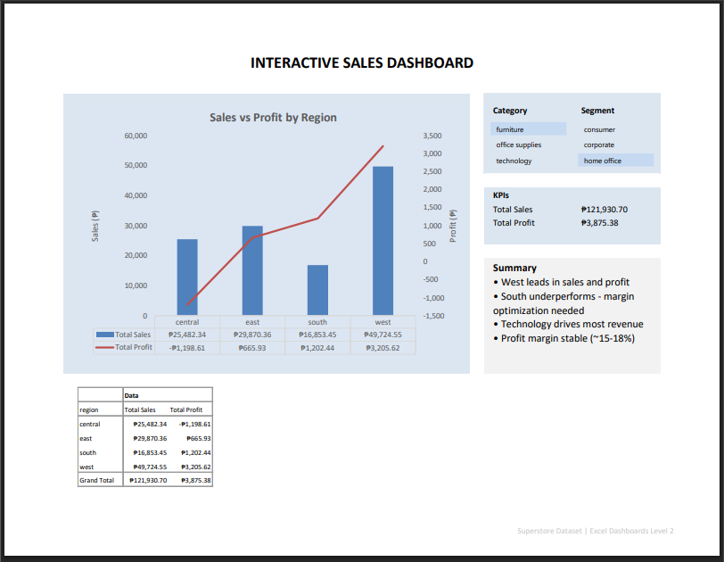

# Superstore Interactive Dashboard (Excel)

Interactive Excel dashboard with slicers (Category, Segment), KPI cards (Total Sales, Total Profit), and a Sales vs Profit combo chart by Region.
 
---

## Preview

### Slicer Controls
- Category: Furniture, Office Supplies, Technology
- Segment: Consumer, Corporate, Home Office
- (Chart, KPIs, and pivot update live when filtered.)  

### Layout
- Chart (left), Slicers + KPIs + Summary (right), Pivot below
- Landscape, print-ready one-pager

---

## Files
- `dashboards/superstore_dashboard_block3.xlsx` – interactive (slicers work)
- `dashboards/superstore_dashboard_block3.pdf` – static portfolio export
- `data_cleaned/superstore_cleaned.xlsx` – source for pivots

---

## Highlights
- Pivot + combo chart (Sales columns, Profit line)
- Slicers for interactivity (Category, Segment)
- KPI cards linked to pivots (auto-update)
- Clean, landscape layout with summary notes

---

## How to Use
Open the `.xlsx`, enable editing, use slicers to filter; KPIs and chart update live.

---

## Credits
Data: Superstore sample (public).  
Author: JP Malit (@blakusnaku).
